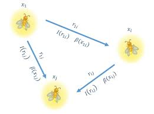

# Improvising Subspace Clustering Algorithm Using Nature Inspired Algorithm

- Subspace clustering is an extension of traditional N-dimensional cluster analysis which allows to simultaneously group features and observations by creating both row and column clusters.
- One of the challenges of working with high dimensional data is that many dimensions are irrelevant and can mask existing clusters in noisy data.
- Subspace cluster analysis can be performed using various heuristic algorithms. In that, we are choosing nature-inspired algorithms such as the firefly algorithm.
- Creating a hybridized algorithm out of the fundamental nature inspired algorithms using a hybridized model of one or more algorithms for subspace cluster analysis.
- The drawbacks of an existing algorithm are balanced out by embedding the features of other algorithms and thus proving the efficiency of the algorithm by performing empirical analysis on the given subspace clusters.
- We aim at creating this hybrid algorithm as a flow between the whale optimization algorithm and the firefly algorithm and thus resulting with a algorithm who could result in a more accurate global minima with each iteration

## Whale Optimization Algorithm


## Firefly Algorithm



Algorithmic Description of hybridized algorithm

```
1: Randomly initialize the whale population.
2: Evaluate the fitness values of whales and find out the best agent X*
3: while t< tmax do
4:     Calculate the value of a
5:     for each search agent do
6:     if h<0.5 then
7:         if |A| < 1 then
8:             X(t+1)=X*(t)-A.D
9:         else
10:           X(t+1)=(Xrand(t)-A.D) * η
11:   else
12:       if |A| < 1 then
13:           X(t+1)=Dη1 ebl cos(2πl)+X*(t)
14:       else
15: 	   X(t+1)=Dη2 eblsin(2πl)+X*(t)
16: Evaluate the fitness of X(t+1) and update X*(t)
17: Postprocess results and visualization
```

#### Where η,η1 and η2 are the hybridization factor and

The hybrid algorithm is an encapsulation of the features which are better in each of them, the hybrid aims to comprise of the hunting property of the whale where usually the hunter leader encircles and some of the hunter whales try and poke a fish out at random. The attractiveness parameter of the firefly algorithm helps the fireflies converge at a much faster rate and we have made use of that in our hybrid.

The positions of the centroids are assigned randomly at first and then from there when they are about to update the position of the centroids it uses a random probability function to decide the course of action while the firefly’s attractiveness parameter is used as a “weight factor” essentially signifying the degree to which the move at a particular direction should be made depending on the other nodes. Thus, we end up with an algorithm which converges quickly but doesn’t get stuck at a local minima.
